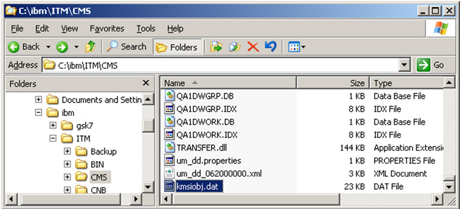
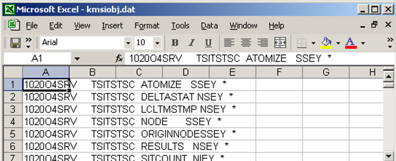
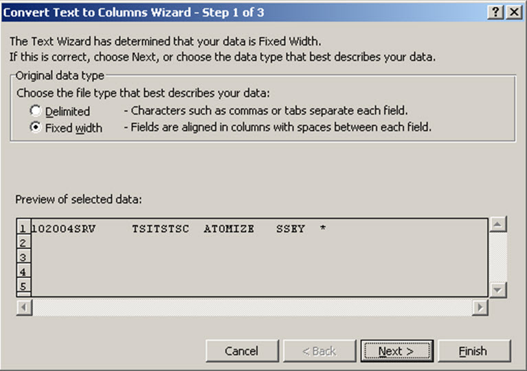
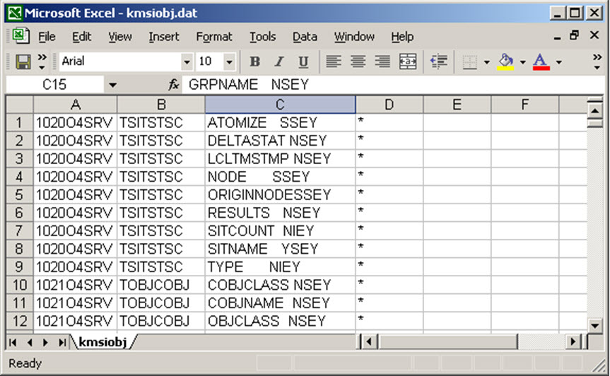

import ArticleDetails from '../../../components/ArticleDetails'

[//]: # (Change the name and date parameters in the following line for it to appear correctly on the site)

<ArticleDetails name="Mark Leftwich" lastUpdated="Aug 8th" readTimeMinutes="15" />

## Overview
This will show you how to extract the TEMS database schema directly from your TEMS machine. You will then be able to build your own SQL SELECT statements to extract information from the TEMS at will. This step-by-step guide will show you how to obtain great information from your TEMS to help you manage your ITM estate. 

 

## HOW TO:

Before you begin to create your own SQL statements, you need to know the names of the tables and the columns in those tables. There are multiple ways to discover this information.

* You may have seen an SQL statement in a ITM RAS1 trace file,
* You may know the table name from past experience.
 

I have posted a few other blogs that will help point you at certain helpful tables (links at the bottom of the blog). 

 

Once you know the table name, you need to know what columns are in that table, so you can create your SQL statement. The steps below demonstrate how to achieve this.

 

1. On your TEMS navigate to the $CANDLEHOME\CMS directory  

2. Find the file called “kmsiobj.dat”

3. Copy this file to the desktop

4. You will now need to open this file with a spreadsheet editor, such as Excel. When you open the file it will look like this:  

5. We now need to sort the data into columns to make it easier to read. To do this first highlight column “A” by clicking on the column header, then
**click “Data” -> “Text to columns”**  
This will display  

6. Select “Fixed Width” then click next.

7. Next again

8. Finally select finish (no other options need to be changed)

You will then have your data sorted as below:

 

You can ignore the first column, the TEMS table name is now in the “B” column and the column names for that table are listed in the “C” column.

 

So in the example above “TSITSTSC” is the table name and one of the columns in this table is “ATOMIZE”.

NOTE: You do not need the “SSEY, NSEY, NIEY, etc” appended on the end of each column name, this is not part of the actual name.

 

So now you can see every table and its columns. This will assist you in creating your SQL for any TEMS table.

**PLEASE NOTE:**  

Please only use SELECT statements against the TEMS. Using UPDATE or INSTERT will only lead you to a world of problems. This guide is for information extraction only  

 

