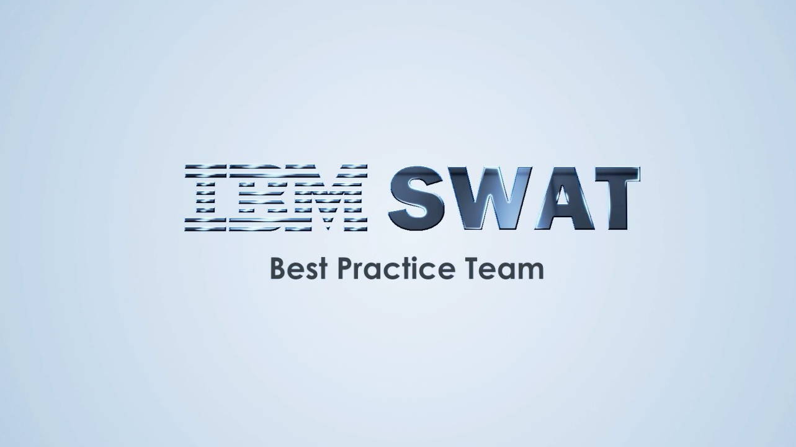

<Row>
<Column colMd={4} colLg={4} noGutterMdLeft>
  <ArticleCard
    title="ICP PreDeployment"
    subTitle="ICP Guide"
    author="Mark Leftwich"
    date="June 19, 2020"
    readTime="15 min"
    href="/ibm-cloud-private/icp-install/icp-predeploy.mdx"
    >

  </ArticleCard>
</Column>
<Column colMd={4} colLg={4} noGutterMdLeft>
  <ArticleCard
    title="Configure Aspera Proxy for use with CP4I"
    subTitle="Aspera Guide"
    author="Ryan Hay"
    date="April 14, 2020"
    readTime="10 min"
    href="/cp4i-guides/aspera-proxy-cp4i"
    >

  </ArticleCard>
</Column>
<Column colMd={4} colLg={4} noGutterMdLeft>
    <ArticleCard
      title="High Speed File Transfer at the Speed of Business"
      subTitle="Aspera Lab"
      author="Ryan Hay"
      date="April 14, 2020"
      readTime="10 min"
      href="/labs/high-speed-file-transfer-at-the-speed-of-business/prerequisites"
      >

  </ArticleCard>
</Column>
</Row>
