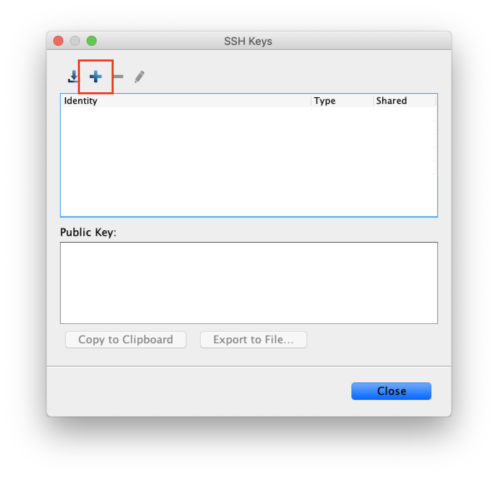

#### SSH Key Authentication

1. Open the Client GUI and select `Tools` and then `Manage Keys...`

1. Select `+` to open the form for creating a new key.

   

1. Complete the form and select `OK`:

   - **Identity**: The name of the new Key.
   - **Passphrase**: Optional password to protect the key. Note: If you configure a
     password each time the client makes a connection to the server you will be asked to
     re-enter this password.
   - **Type**: Leave as RSA Access: Select if you would like all users of the Client
     machine to be able to use this key to authenticate with the Server.

1. Copy the `Public Key` displayed in the lower pane of the SSH Keys window.

1. Login to the Server

1. Prepare the `asp1` user for key based authentication.

   ```bash
   mkdir /home/asp1/.ssh
   touch /home/asp1/.ssh/authorized_keys
   chown -R asp1:asp1 ~/.ssh
   chmod 700 ~/.ssh
   chmod 600 ~/.ssh/authorized_keys
   ```

1. Paste the `Public Key` copied from the Client into the
   `/home/asp1/.ssh/authorized_keys` file

export default ({children}) => <div className="accordion-list">{children}</div>
