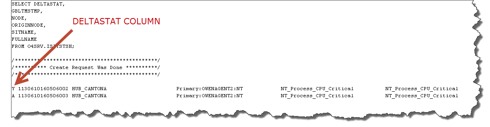
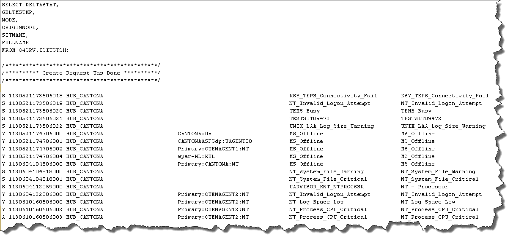

import ArticleDetails from '../../../components/ArticleDetails'

[//]: # (Change the name and date parameters in the following line for it to appear correctly on the site)

<ArticleDetails name="Mark Leftwich" lastUpdated="Aug 8th" readTimeMinutes="10" />

## Overview
The goal is to be able to pull information on which situations have fired (event raised), been acknowledged, or closed from across the entire monitoring infrastructure straight from the HUB TEMS itself.  There are many reasons why you would use this method, here are a few:

* You can sanity check the events you see in your TEPS GUI are the same as what the ITM infrastructure sees

* You can make sure all RTEMS are sending events, as you can see the TEMS (throughnode).

* You can also check if acknowledgements are being received by the TEMS (that were sent from Omnibus or TEC)

* You can fire test events from an agent and track it through the RTEMS, to the HUB and check it appears in the TEP GUI (situation events console)  

## Understanding the process
Today we will be using the KDSTSNS tool with some SQL to query the situation status table on the HUB TEMS, specifically the ISITSTSH table. As in the first blog of the series explained how to query the TEMS, the below information explains how to interpret the output of the SQL, so you can utilise the information for you own means. I will start by breaking down what each column means in the table we are querying and they go through a basic example of how the TEMS processes events. This will give you the basics to go away and try it for yourself!

 

Each of the rows in the below table represents is a column in the ISITSTSH table on the TEMS and its meaning. You will need to query this table on the TEMS using SQL provided to retrieve the required data.

 

| Name of Column | Information held in that column |
|---|---|
| DELTASTAT | Delta stat is a single letter that represents the status  of that row (full table below) | 
| GBLTMSTMP | Time that the record was written |
| NODE | This will be an endpoint name associated with that record |
| ORIGINNODE | Name of the TEMS the agent directly reports  to (also known as throughnode) |
| SITNAME | Situation name that created the event |
| FULLNAME | Situation full name if it has been given one (6.21 and beyond) |
| TYPE | If the situation is sampled = 0 and Pure =1 |  

The key to understanding the output is the Deltastat column, it will have a single letter in it and this shows you the status of that event/situation.

 

| DELTASTAT Column Value | Meaning of the letter |
|---|---|
| Y - Event raised | Event has been Raised from the  situation named on that record line |
| A - Event Acknowledged | Event has been Acknowledged from the  situation named on that record line |
| N - Event Reset/Closed | Event has been rest/closed (the event is no longer true) |
| E - Acknowledgement retracted | Acknowledgement of the event has been retracted (very rare to see) |  
  
  
Now you know how to read the data, you need to understand the processing of the TEMS

## Example scenario:

1)       Condition is met on an agents and an event is fired. A "Y" record appears in the DELTASTAT column to show the event as raised

2)       An operator will then acknowledge the event. This will place a second row in the table with an "A" next to it.

From the output below, you can see an event has been raised "Y" and that it has been acknowledge "A" for the same endpoint. The agent name, throughnode (TEMS agent reports directly to) and the situation name all have the same value. As these values are all the same, you can tell the raised "Y" and acknowledge "A" event came from the same agent which was connected to the same TEMS (HUB_CANTONA).

If the situation is no longer true (either the condition returns below the threshold set in the situation for a sampled situation, or an operator closed the event for a pure situation), then all rows matching the same criteria for that particular situation are removed and replaced with a "N" reset/closed row. You will never see a "Y" or an "A" row if an "N" row is present, as it clears and resets that situation ready for when the situation fires again.
  
When you query your own TEMS tables, use the information above to guide you. You can use it to check which situations/events have been raised, acknowledged or closed.  
  

## How to retrieve the key information
For the method of how to retrieve the data and where to put the files. This was covered in post one in the series:   Link - Blog 1 

 

You will need to execute this SQL:

 

SELECT DELTASTAT,  
GBLTMSTMP,  
NODE,  
ORIGINNODE,  
SITNAME,  
FULLNAME   
FROM O4SRV.ISITSTSH;  
 
 

## Result:
 

Here is an example output from my test system:

 

 

 

## What next?
You now have the methodology and the SQL to get the data you need. You could perform health check, test events, etc.  You could also open up the resulting file in a spreadsheet editor. A quick text to columns and you can filter away on a single agent, TEMS, situation, DELTASTAT type to really refine masses of information down to concise quality checks.

 

Hope this has been of use to you. If you have any questions or you would like me to build a test case to find a specific piece of information, please post below and I will respond to you.

 