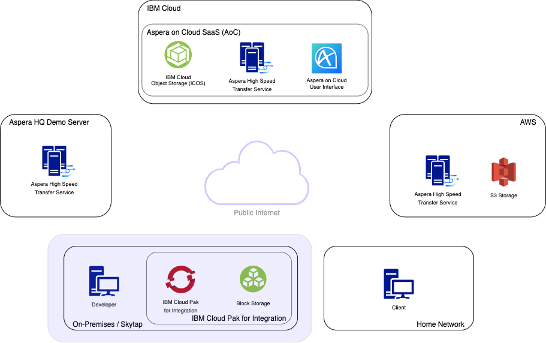
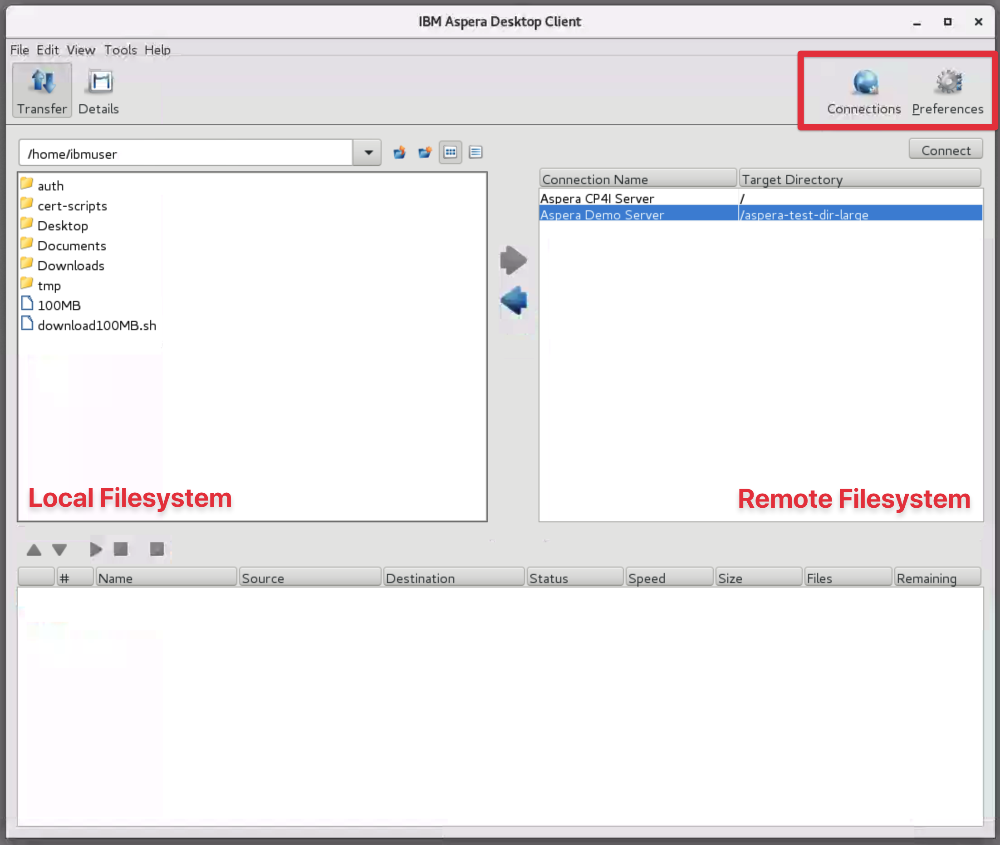
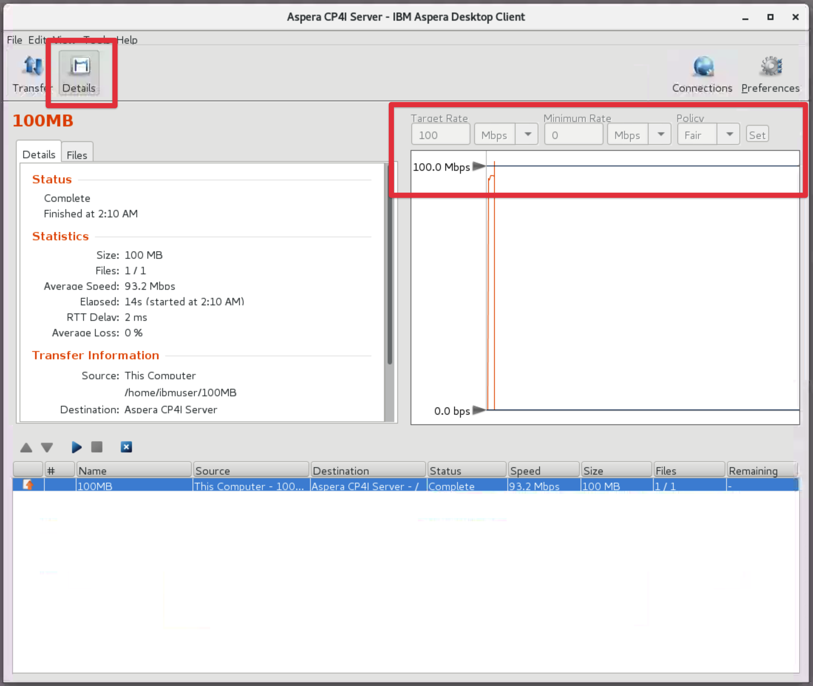
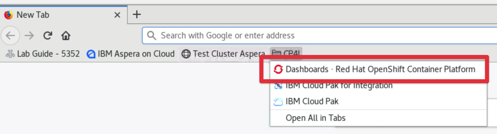
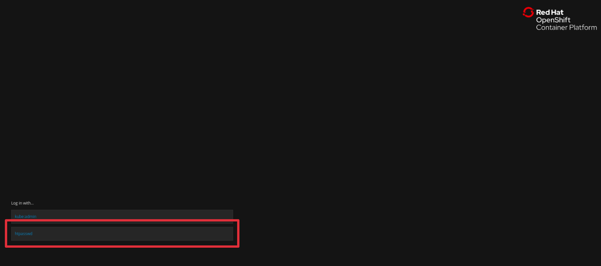
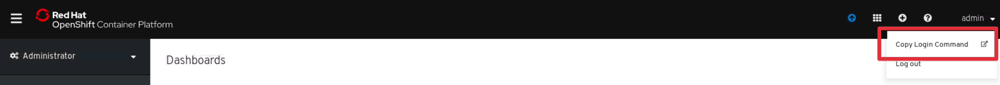
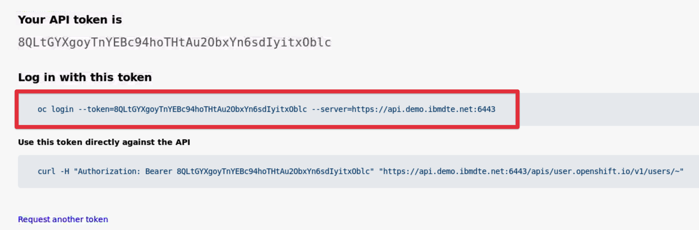
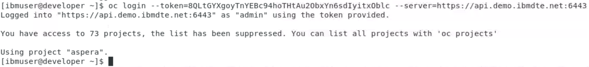
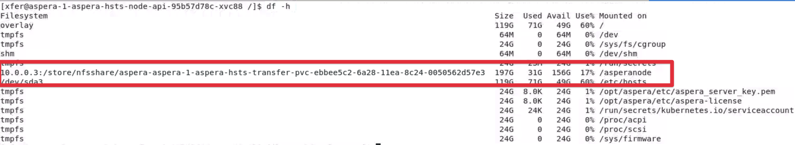
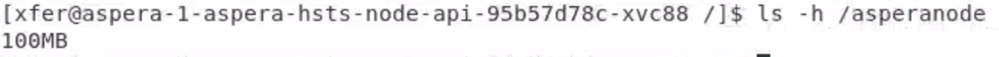

export const Title = () => <span>High Speed File Transfer at the Speed of Business</span>

## Connecting to Cloud Pak for Integration with the Aspera Native Client

You will now use the Aspera Client GUI to upload a file to a different Aspera Server. In
this section of the lab you will be connecting to an Aspera Cluster running in IBM's Cloud
Pak for Integration (CP4I). Aspera in CP4I is a cloud-native microservices based
deployment of the Aspera Server built on-top of OpenShift.



## Let's get started

1. Open a new Terminal window by double clicking the Terminal icon on the desktop.

1. Run the following command to open the Aspera Client GUI

   ```bash
   asperascp
   ```

   You can minimise the Terminal window once the client has started. You must leave the
   terminal window open for the life of the Client process.

   

- The Aspera Client GUI features the local filesystem on the left of the app and the
  remote filesystem on the right.
- The `Connections` button allows you to add new Server connections to the Remote
  Filesystem pane. There are currently two connections configured; the Aspera CP4I Server
  and the Aspera Demo Server.
- The `Preferences` button displays client side preferences. If you click this you will
  see that the current 'Default Target Rate' is set to 100Mbps, the client will not exceed
  this rate.

> At this point you can understand how the GUI makes downloading from remote filesystems
> easier... When connected you can easily browse the content on the remote server.

## Upload a file to the Aspera Cluster running in CP4I

1.  Change the local filesystem (left pane) directory to `/home/ibmuser/`

1.  Select 'Aspera CP4I Server' from the remote filesystem (right pane) and select
    'Connect'.

    The client will make a connection to the Aspera Cluster in CP4I. You are now able to
    browse the clusters underlying NFS filesystem... it is empty to begin with.

1.  Perform an upload by simply dragging and dropping the file downloaded in section one
    `100MB` from the left pane to the right.

    You can select the active session from the bottom panel and then click on `Details` in
    the upper left corner of the window to see the status for the transfer and optionally
    adjust transfer rates.

    

## **Optional**: View the file is in the clusters NFS attached storage

<InlineNotification kind="info">
  The following steps are optional and only need to be completed if you would like to see
  for yourself the file that you have just transferred to the clusters NFS filesystem.

You will do this by getting access to a shell on one of the containers and viewing the
contents of the mounted storage.

</InlineNotification>

You have now successfully uploaded the file to an NFS persistent volume configured in the
OpenShift cluster. You can confirm this by accessing the container and viewing the mounted
storage.

#### Log in the Openshift CLI

1.  Select the `Dashboards - Red Hat OpenShift Container Platform` bookmark in Firefox.

    

1.  Select Log in with `htpasswd` and use the `admin` credentials already saved in the
    browser.

    

1.  Select `admin` dropdown from the top-right corner and then the `Copy Login Command`
    button

    <br />

    

    <br />

    **Note:** You may be asked to log in again. Use `htpasswd` and the `admin` account
    again.

1.  Select the `Display Token` hyperlink to revel the API Token information

1.  Copy the content from the `Log in with this token` codebox

    

1.  Minimise Firefox so you can see the Desktop and double click the Terminal app to open
    a new window.
1.  Paste and execute the `oc login` command to log into the OpenShift cluster on the CLI.

    

1.  Execute a bash prompt in the Aspera Node API container by running

    ```bash
    oc -it exec aspera-1-aspera-hsts-node-api-56d574bf77-sk5ns -c asperanode -- bash`

    ```

1.  View the NFS mount mounted on `/asperanode` to the cluster by running

    ```bash
    `df -h`
    ```

    <br />

    

1.  List the contents of the mount to confirm the file is now available inside of the
    cluster:

    ```bash
    ls -h /asperanode
    ```

    <br />

    

1.  Exit the bash prompt

    ```bash
    exit
    ```

## Recap

You have now moved the file that you downloaded from the Aspera Demo server into a
containerised OpenShift environment, other pods can now access this data.

In a later section you will be using the Aspera API to trigger a transfer that moves this
file from the OpenShift cluster to IBM Cloud Object Storage. To do this you require a
special token that allows you access to the storage. Fortunately the token has already
been generated for you and is currently sitting in a bucket in AWS S3 in Toronto. In the
next section you will use the browser and the `Aspera Connect Client` to download this key
from S3 bucket in Toronto.
