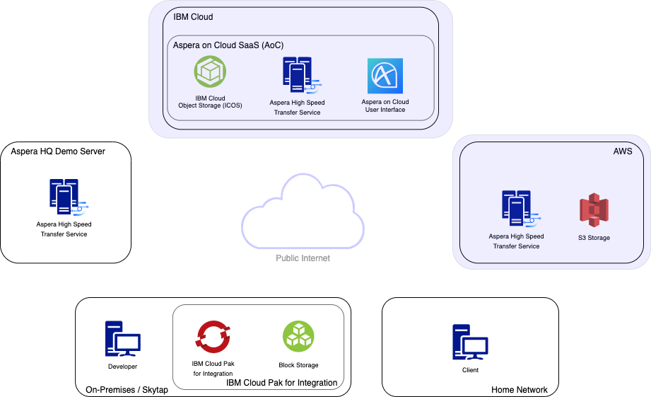
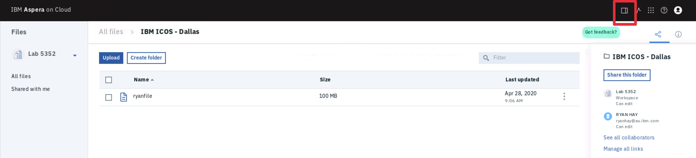
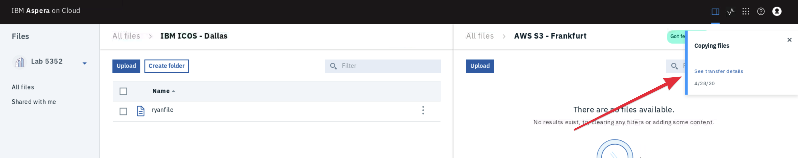

export const Title = () => High Speed File Transfer at the Speed of Business

## Move Content between Clouds

Your file is now in the cloud. Dealing with multiple cloud providers is common and moving
data between them should be easy. In this section you will move your file from IBM Cloud
Object Storage in Dallas to AWS S3 Storage in Frankfurt.

## Lets Go

1. Navigate to the `IBM ICOS - Dallas` folder so you can see your custom filename.

1. Select the `split view` button in the toolbar at the top-right of the page to open
   another pane to the right of your existing view.

   

1. Select the `AWS S3 - Frankfurt` directory

   

1. Drag and drop your file from the IBM ICOS Dallas storage in the left pane to the AWS S3
   Frankfurt storage in the right pane to initiate a cloud-to-cloud transfer. Once you
   drop your file into the right pane you will be notified that a copy has begun.

   **Note:** You can hold `alt` when dropping to perform a `move` rather than a `copy`.

   

1. View the status of the transfer by selecting the `Transfer Monitor` button from the
   toolbar.

   

## Recap

You have now successfully copied your file between clouds from IBM ICOS in Dallas to AWS
S3 in Frankfurt. It is important to note that Aspera does not modify or store these files
in any proprietary way. Other services or processes running in the cloud can easily access
the content of these buckets if you allow them.

You have one more section to go. Let's take a look at how you might distribute your file
to someone else inside or outside of your organisation.
