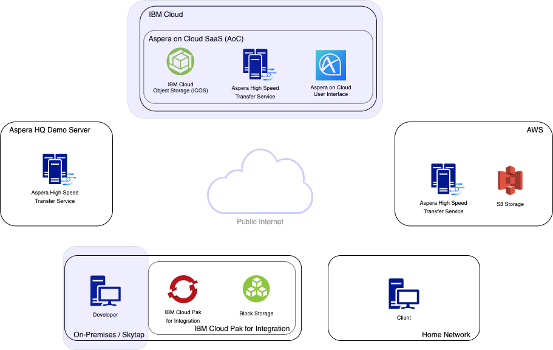
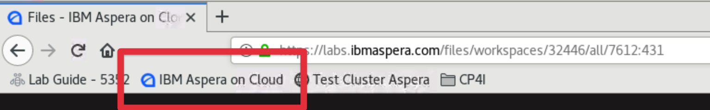
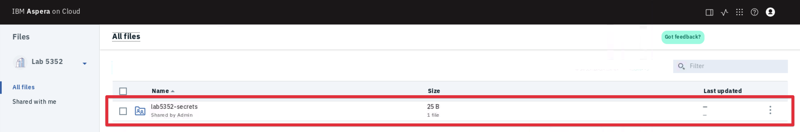
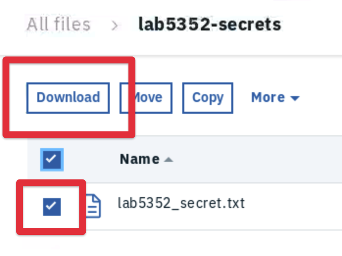
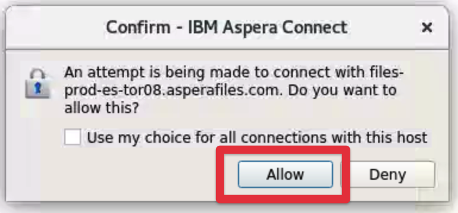
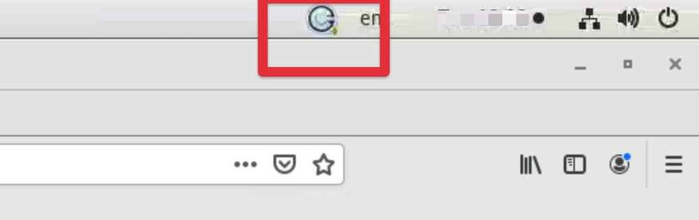

export const Title = () => High Speed File Transfer at the Speed of Business

## Downloading from Aspera on Cloud with the Aspera Connect Client

You are now familiar with two different methods of initiating an Aspera transfer; using
the CLI and using the native Aspera Client. Another option is to use the `Aspera Connect`
client application.

Aspera Connect is designed to allow simple FASP uploads and downloads using the browser.
Lets now use the Aspera Connect Client to download the file that contains the token that
you need for the API in the next section of this lab.

## Lets Go

1. Navigate back to Aspera on Cloud and ensure you are still logged in

   

1. Navigate into the `lab5352-secrets` directory by selecting the folder

   

1. Select the checkbox for the file `lab5352_secret.txt` and select `Download`

   

   **Note:** The first time connecting to a remote node using Aspera Connect you will be
   asked to accept the connection that is being made. Select `Allow` and your download
   will begin.

   

1. The Aspera Connect application will open and display the progress of the transfer

   

   - 1: Adjust transfer speeds in realtime
   - 2: Open containing folder
   - 3: Stop and start transfer

   **Note:** If the Aspera Connect Client window is not focussed you can select the icon
   in the toolbar to bring it into focus.

   

   Once complete the file `lab5352_secret.txt` will be available locally in
   `/home/ibmuser`.

## Recap

Aspera on Cloud makes it easy for you to get access to your files no matter where they are
located in the world. In this section you used the Aspera Connect Client to download a
file hosted in AWS S3 Toronto.

Now you have the token you can use the Aspera API to initiate a remote transfer between
the CP4I OpenShift environment and storage connected to Aspera on Cloud.
