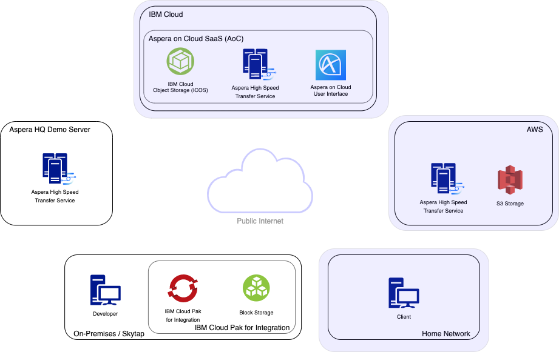
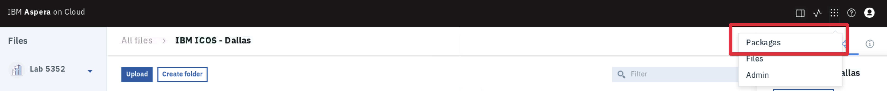
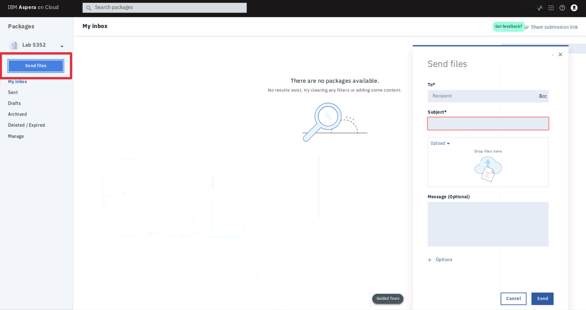
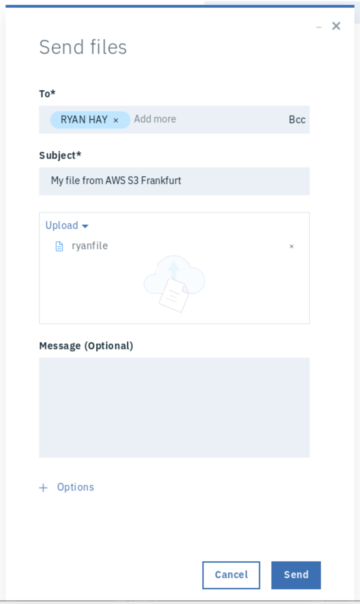
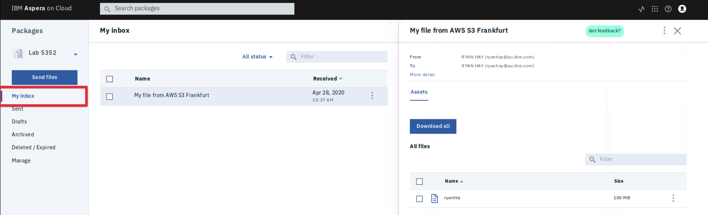
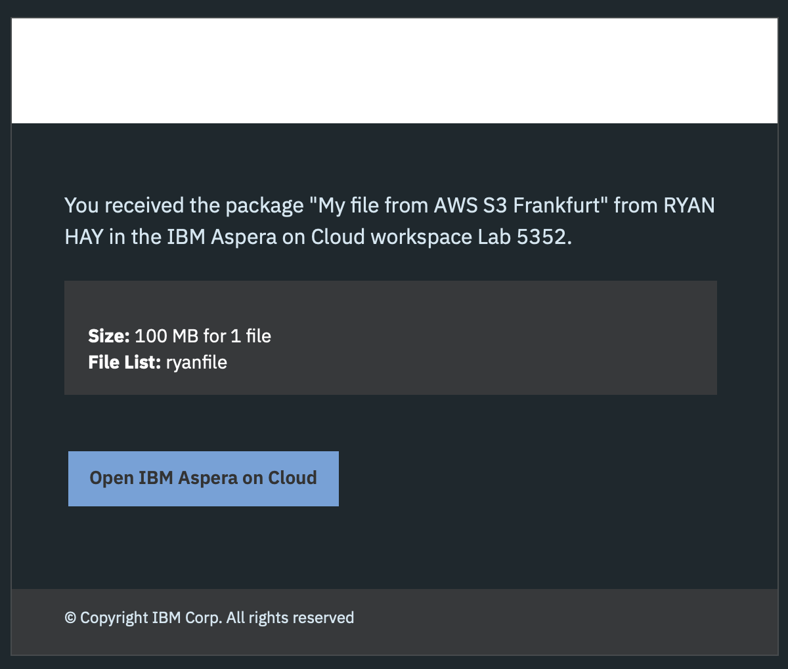
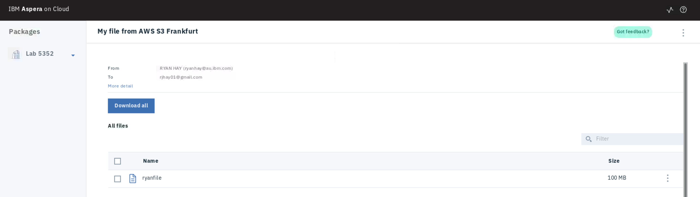

export const Title = () => High Speed File Transfer at the Speed of Business

## Distribute Content Using Aspera on Cloud

You have seen that you are able to push our data to the cloud and then once in the cloud
you can move it around. What happens when you need to access, modify or deliver that data
to others? Let's take a look at an application available in Aspera on Cloud called
`Packages`.

The AoC Packages app allows you to package up content and send it like an email but of
course at maximum speeds, with end-to-end security and with no file size limitations. You
also have the flexibility of sending content from anywhere in the world, for example; from
ICOS in Dallas or S3 in Frankfurt directly to someone.

You file now resides in AWS S3 in Frankfurt. Lets now package this file up and send it to
ourselves via email.

## Lets Go

1. Switch to the Aspera on Cloud Packages App using the App Switcher in the toolbar at the
   top-right of the screen.

   

1. Select the 'Send Files' button to open the Send Files form to begin composing a
   package.

   

1. Complete the required fields in the `Send Files` form:

   - **To:** This is the email that a link will be sent to where the recipient can
     download the content you are about to send. You can enter your student email you used
     to log in to Aspera on Cloud and you will be able to view the package in the
     `My Inbox` tab in the left panel on the page. Note: Entering an external email
     address has been disabled for this lab.
   - **Subject:** Enter an email subject
   - **Upload:** Here you can choose the contents of the package. Select `Upload` and then
     select `Upload from Files`. You can now select your file from IBM ICOS or AWS S3 and
     add it to the package.

   **Note:** If adding multiple sources, e.g. local filesystem, IBM ICOS and AWS S3 the
   files will each be uploaded to central storage to compose the package and then the
   email will be sent to recipients.

   

1. Click `Send`. As always you can select the `Transfer Monitor` from the toolbar to view
   the status of the transfers.

1. Once the package has been uploaded and delivered you will see the package available in
   `My Inbox` (because you sent it to yourself) located in the left navigation bar of the
   Packages application. Note: An email would have been sent to the email address too but
   you don't have access to that with the demo accounts.

   

<InlineNotification kind="warning">
  Because sending to external email accounts has been disabled in this lesson you will not
  be able to see the email sent with the package link. You can read through the next two
  steps to see what this would look like.
</InlineNotification>

1. When a package has been delivered the end user will receive an email with a link to the
   package.

   

   **Note:** This is the default email template. This template can be customised.

1. Open the package by clicking the `Open IBM Aspera on Cloud` button and you will be
   taken to the package view page where you can download the package.

   

## Recap

In this section you created a new Package and sent it to yourself directly from AWS S3 in
Frankfurt or IBM ICOS in Dallas to an end-user.

## The End

Congratulations you have finished the lab. You have just used Aspera to transfer a file
between at least three different different geographic locations using a CLI, native
client, browser based client and API.
