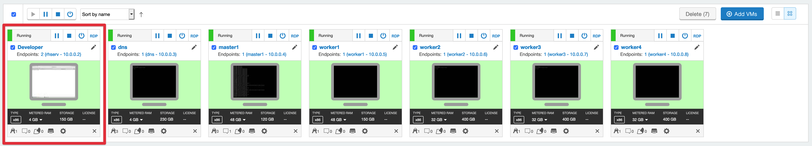
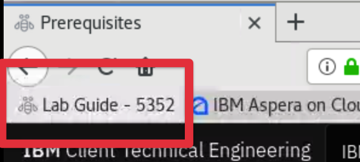
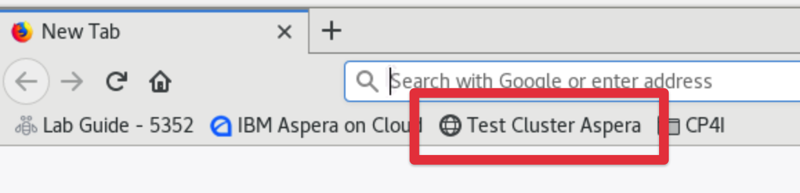
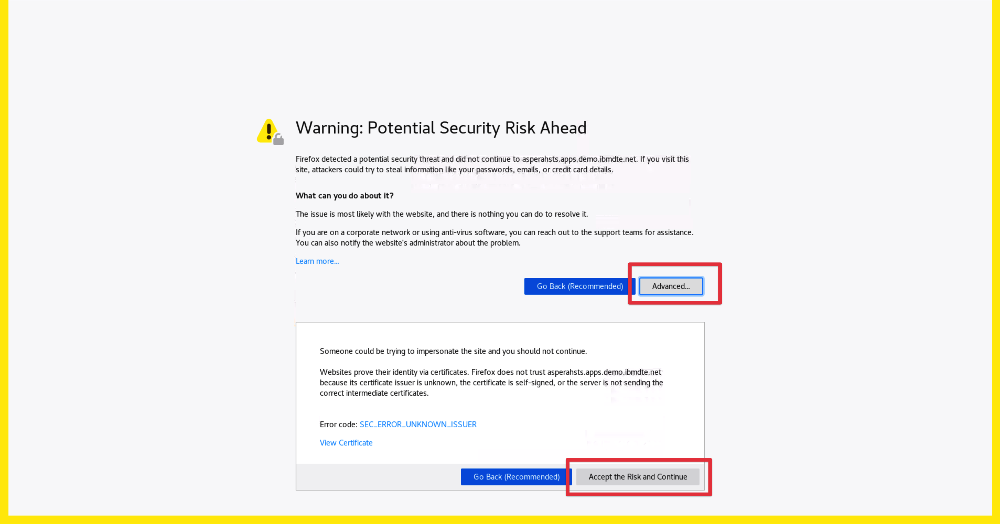
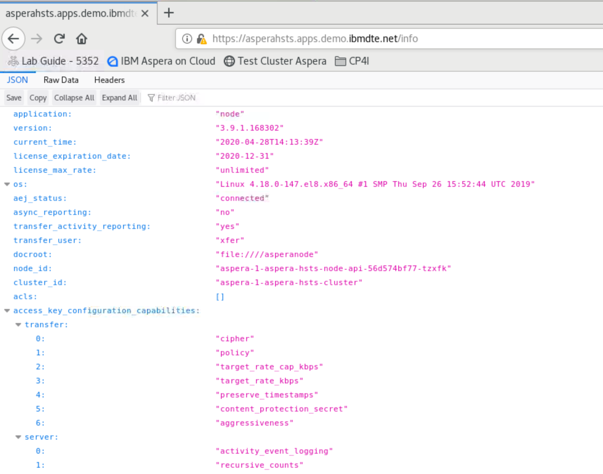
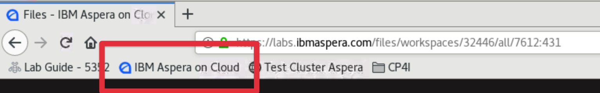
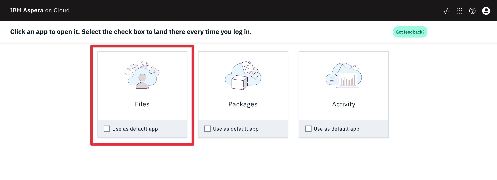
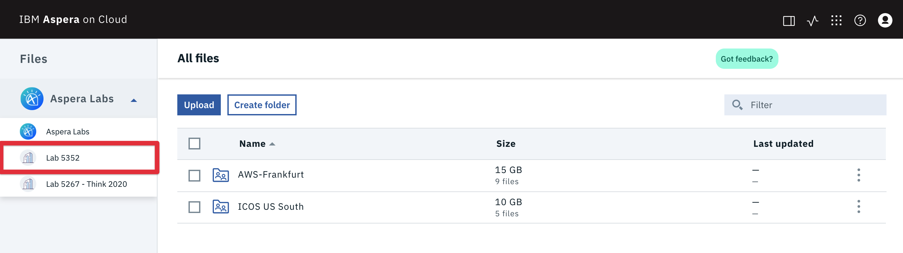

Before beginning this lab there are some prerequisite tasks that must be completed to
ensure you have access to the necessary systems. Please complete the following
prerequisite tasks before:

#### Load the working environment

In the SkyTap environment select the 'Developer' machine and login as the user `ibmuser`
with the password `engageibm`.

#### Open the lab guide

To make copying snippets easier it is recommended to have the lab guide open by selecting
the `Lab Guide - 5352` bookmark in Firefox.

#### Confirm the Aspera Transfer Cluster in CP4I is running

1.  Select the `Test Cluster Aspera` bookmark in Firefox. This bookmark queries the
    `/info` api.

    

1.  Accept the security warning

    

1.  Use the saved credentials. A JSON output indicates the Aspera Transfer Cluster is up
    and running.

    

#### Log in to Aspera on Cloud

1.  Select the `IBM Aspera on Cloud` bookmark.

    

1.  Login with your unique student number assigned to you. This can be found on the same
    screen that you launched the lab from. Substitute 'XX' below with your assigned
    student number.

    `thinklabs2020+XX@gmail.com`

    The password will be pasted in the class chat.

1.  Select `Files` as your default app if you are prompted.

    

1.  Select the Workspace `lab 5352` from the Workspace switcher on the left of the screen
    by selecting the name of the current workspace. This is the only workspace you will be
    using for this lab.

    

You are now ready to begin the lab

export default ({children}) => 
{children}

