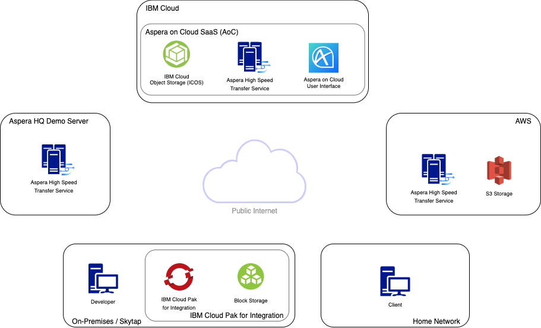

import Preparing from './prerequisite-preparing.mdx'
import Troubleshooting from './prerequisite-troubleshooting.mdx'
export const Title = () => High Speed File Transfer at the Speed of Business

## Lab Overview

<InlineNotification kind="info">
  If you are unfamiliar with Aspera it is recommended to read{' '}
  <a href="/labs/about-aspera/about-aspera">About Aspera</a> before starting this lab.
</InlineNotification>

The objective of this lab is to help you understand the various ways in which Aspera can
help you move your data in a hybrid cloud environment. Throughout this lab you will focus
on a single file and move it between clouds, on-premises and home network environments.
Each file transfer will use a different method of initiating an Aspera transfer so you
will become familiar with options you have available.

Below is an overview of the environment you will be using for this Lab.

You don't need to understand where and how all of these components work together to create
a hybrid cloud file transfer solution just yet, that's the purpose of this Lab. By the end
of this Lab you will understand the multitude of options you have available to you to move
content easily between all of these components.

**Note:** Please keep in mind that for all of these file transfer tasks you will complete
this lab there are multiple ways in which each could be handled, we just picked one in
each circumstance. At the end of the day FASP is a transport layer technology and
everything built on-top offers a different method of invoking that protocol.

Please complete the following prerequisite tasks in 'Preparing the lab environment' before
moving on with the lab. Reach out to your lab instructor if you have any issues.

<Accordion>
  <AccordionItem title="Preparing the lab environment">
    <Preparing />
  </AccordionItem>
  <AccordionItem title="Troubleshooting">
    <Troubleshooting />
  </AccordionItem>
</Accordion>
