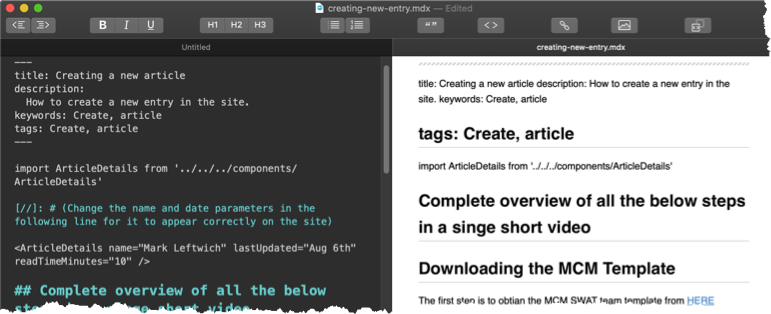

import ArticleDetails from '../../../components/ArticleDetails'

[//]: # (Change the name and date parameters in the following line for it to appear correctly on the site)

<ArticleDetails name="Mark Leftwich" lastUpdated="Aug 11th 2020" readTimeMinutes="10" />

## Complete overview of all the below steps in a single short video

<iframe width="560" height="315" src="https://www.youtube.com/embed/SjWHsMmo9lI" frameborder="0" allow="accelerometer; autoplay; encrypted-media; gyroscope; picture-in-picture" allowfullscreen></iframe>

## 1 - Downloading the MCM Template
[//]: # (add one to two lines describe what the article is about below)
The first step is to obtain the MCM SWAT team template from [HERE](https://ibm.box.com/v/mcm-doc-template)  

## 2 - Modifying the template file name  
You will need to re-save the file you just downloaded with your own file name.  

**Tip:** Make the name short, but reflect the subject of the article. It will make it easier when deploying later

* You must keep the file characters in lower case
* You can use characters a-z 0-9 (no special characters)
* The file must retain its .mdx file extension

Note the directory you saved the file in as you will need to open this in your editor of choice to make changes/updates.

## 3 - Markdown editors

You will need to open the newly saved file with an editor of choice

### Recommendations for editors:
**Mac**    
MacDown is a great open-sauce editor that has a live preview window (so you can see the changes you are making as you type).

[](https://macdown.uranusjr.com/)

**Windows**

## 4 - Modifying the template header section

The first section that needs to be modified is the header section as (below)


```
---
title: Sample Title
description:
  How to create a new entry in the site.
keywords: Create, article
tags: Create, article
---
```

### title:
You will need to modify this parameters value to the exact title you wish to be displayed on the webpage for your article.

### description:
This needs to be a one sentence summary of what your article is about

### keywords:
List some keywords that you think would direct users to your article in a google search

### tags: 
List some tags that may help group your article on the site. If not sure what to put here, copy the "keywords" here too.


## 5 - Modifying the author, date and readtime
You will need to modify the name, date and time parameters as displayed in the extract below. These changes will appear at the top of your article when it is published to the site. They will give the reader indication of who wrote the article and how long they can expect to take to read the whole document.

```
import ArticleDetails from '../../../components/ArticleDetails'

[//]: # (Change the name and date parameters in the following line for it to appear correctly on the site)

<ArticleDetails name="Mark Leftwich" lastUpdated="Aug 5th" readTimeMinutes="10" />
```

### ArticleDetails name=
The "ArticleDetails name=" needs to be changed to your name.
 - This will appear at the top of your article when it is published to the site.

### lastUpdated=
The "lastUpdated=" needs to be updated to the date of the last time you edited the article.
 - If this is a new article put todays date, if you are editing an article remember to update this to let readers know changes have been made / the document

### readTimeMinutes=
Again the "readTimeMinutes=" value needs to be updated with numeric characters. This is your estimate of how long it will take the reader to read your article.


## 6 - Overview
In this section you need to provide a few sentences as a summary of what your article is about. This will  
 - A) Help the reader identify quickly if this is the content they are searching for.  
 - B) Help with indexing and search ability.  

 
## 7 - Adding your customised content
After you have completed all the steps above, the article is now formatted and ready for the website to post. The next steps are down to you, it's adding your own content.

You will see a line in the template (that is hiding on the web) like the example below.

```
.[//]: # (Add all of your content below this line)  

```
You need to add all of the content you wish to publish after this line.
**NOTE: Please see the other articles in the "Website Guide" section for more how-to's and tips on creating your own content.


## 8 - Article footer
There is a section of code at the bottom of the template that needs to remain when you post your article it looks similar this example. You do not need to touch this. Just ensure it resides at the bottom of your article (after all of your updates).

I have modified the code so it displays text in this article rather that the banner you see in the finished result:


``` 
[](https://ibmintegration.github.io/cp4mcm-swat-kb/)
```

We need to keep this banner in all the articles for brand recognition (trusted source of information) and to provide a constant click flow from the site on all pages.


[](https://ibmintegration.github.io/cp4mcm-swat-kb/)
